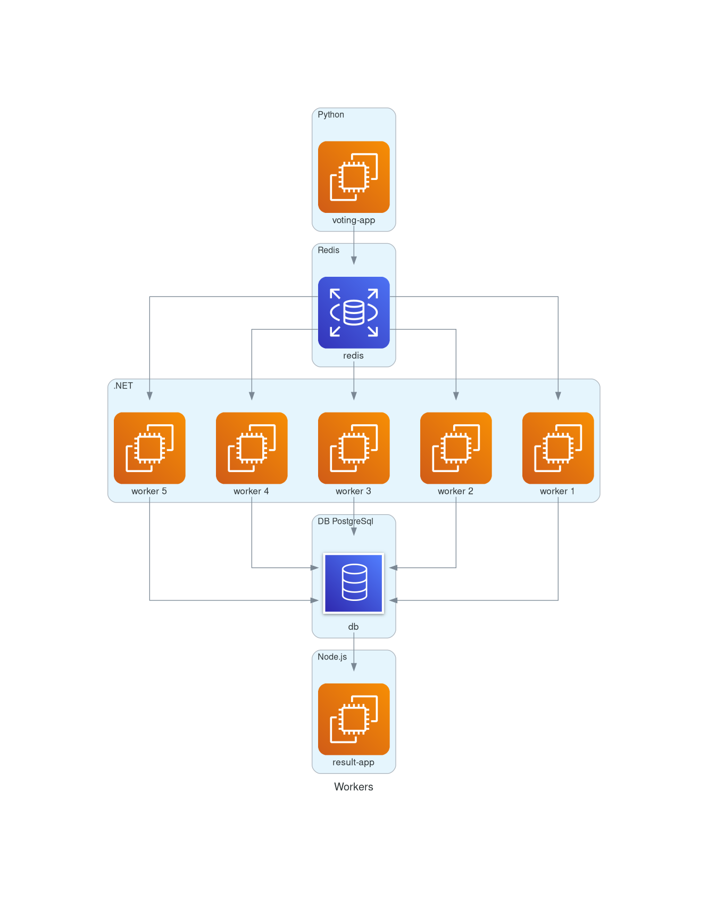

# Pequeno exemplo utilizando docker-compose e docker-swarm

## Pasta exemplo1 - docker com docker-compose
## Pasta exemplo2 - docker-swarm com docker-compose
### Diagrama do projeto


### Imagem foi gerada com o [python-diagrama](https://diagrams.mingrammer.com/)
### Realizar as [instalações necessárias](https://diagrams.mingrammer.com/docs/getting-started/installation)

### Exemplo de código diagram.py

``` python
from diagrams import Diagram, Cluster
from diagrams.aws.compute import EC2
from diagrams.aws.database import DB, RDS
from diagrams.aws.network import ELB

with Diagram("Workers", show=False, direction="TB"):

    with Cluster("Python"):
        votingApp = EC2("voting-app")

    with Cluster("Redis"):
        redis = RDS("redis")

    with Cluster(".NET"):
        svc_group = [EC2("worker 1"),
                     EC2("worker 2"),
                     EC2("worker 3"),
                     EC2("worker 4"),
                     EC2("worker 5")]

    with Cluster("DB PostgreSql"):
        postgreSql = DB("db")

    with Cluster("Node.js"):
        resultApp = EC2("result-app")

    votingApp >> redis

    redis >> svc_group
    svc_group >> postgreSql

    postgreSql >> resultApp
```
### Depois apenas rodar executar:
``` bash  
python diagram.py
```


